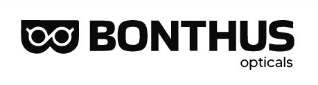

<p align="center">
  
</p>

# Bonthus Opticals - Virtual Try-on Widget

Offer glasses virtual try-on to your users with this JavaScript widget. The experience is in real-time: the user sees their face like in a mirror, but with glasses on.

## Features

* Real-time web based glasses virtual try on.
* Light reconstruction (ambient + directional).
* Robust facial tracking for various conditions.
* Works on both mobile (iOS, Android) and desktop.
* High-end 3D engine with PBR material rendering.

## Usage

```jsx
import * as React from 'react';
import { GlassArView } from "@bonthus/glassarview";

function App() {
  return (
    <GlassArView
      modelname="rayban_aviator_or_vertFlash"
      canvasheight={500}
      canvaswidth={500}
    />
  );
}

export default App;
```

## Props

| prop | type | default | example |
| :--- | :--- | :--- | :--- |
| **modelname*** | string | rayban_aviator_or_vertFlash | The SKU name of the glasses model. |
| **canvaswidth*** | number | screen size | Custom width for the AR canvas. |
| **canvasheight*** | number | screen size | Custom height for the AR canvas. |
| **buttonFontColor** | color | white | Color of the UI button fonts. |
| **buttonBackgroundColor** | color | #FFE5B4 | Background color of UI buttons. |

## Compatibility

* Requires **WebGL2** for best performance.
* Fallback to WebGL1 with specific extensions is supported.
* Requires camera access through a secure HTTPS connection.

## Contact

For support and inquiries, please contact **Bonthus Opticals**.
